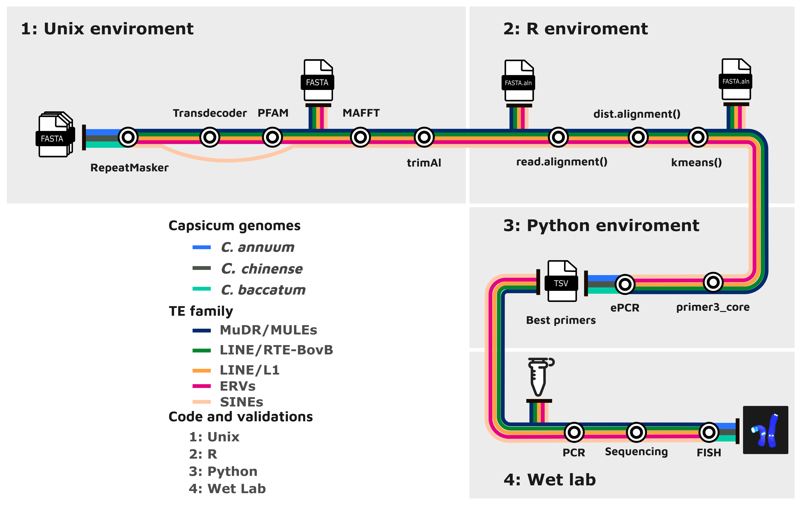

# Parallel e-PCR and Primer3 Pipeline

This repository contains a pipeline for designing and selecting primers using Primer3, followed by in silico validation through e-PCR. The script is optimized for parallel execution to improve performance.

## Workflow



## Table of Contents
- [Installation](#installation)
- [Configuration](#configuration)
- [Usage](#usage)
- [Input](#input)
- [Output](#output)
- [Parallel Execution](#parallel-execution)
- [Notes](#notes)

## Installation
Ensure you have the required dependencies installed:

- Python (>=3.6)
- Biopython
- Multiprocessing
- Primer3
- e-PCR

Clone this repository:
```sh
git clone https://github.com/yourusername/repository.git
cd repository
```

## Configuration
The script assumes the following directory structure:
```plaintext
transposable_elements/
  ├── bin/
  │   ├── e-PCR
  │   ├── primer3
  ├── output/
  │   ├── input_ePCR.tsv
  │   ├── sequencias.fasta
  │   ├── output.p3
  │   ├── primerBlast.txt
  │   ├── output_p3.tsv
  ├── src/
  │   ├── 01_primer_designANDselection.py
```
Modify paths in the script as necessary.

## Usage

The script should be executed in two steps:

When the user has the nucleotide sequence alignment in FASTA format, as in the previous example, using an alignment of ERVs available in the caulimovirus_mafft/data/cluster_01_caulimovirus.aln directory of this project:

```sh
python src/01_primer_designANDselection.py caulimovirus_mafft/data/cluster_01_caulimovirus.aln
```

This step processes the alignment and generates the necessary input files (primerBlast.txt) for e-PCR inside the "output" directory.

When the user has already run step 1 and has the primerBlast.txt file:

```sh
python src/01_primer_designANDselection.py <path to the alignment> output/primerBlast.txt
```

This step uses the previously generated primer validation results to select the best primers.

## Output
The script generates several output files in the `output/` directory:
- `sequencias.fasta`: Unaligned sequences extracted from input alignment.
- `input.p3`: Primer3 input configuration file.
- `output.p3`: Primer3 output.
- `output_p3.tsv`: Formatted output with primer sequences and metadata.
- `input_ePCR.tsv`: Input for e-PCR.
- `primerBlast.txt`: e-PCR results.
- `best_primers.tsv`: Filtered list of best primers based on alignment quality and target specificity.

## e-PCR Notice

The e-PCR software was originally discontinued, as documented in Schuler (1998). However, in this repository, we use it strictly for performing electronic PCR (e-PCR) to validate primers in silico. The binary version of e-PCR is included in the `bin/` directory and must be properly referenced in the script.

## Parallel Execution
The script utilizes multiprocessing to:
- Run e-PCR in parallel across multiple input partitions.
- Process large e-PCR outputs efficiently.

The number of processes is determined dynamically based on the system's CPU count, with a maximum of 4 parallel executions.

## Notes
- If running the script for the first time, ensure necessary files are removed or regenerated.
- The script prompts the user if they have already executed previous steps.
- Paths for e-PCR and Primer3 binaries must be configured correctly in the script.

---
Developed by **Edson Mario de Andrade Silva, Ph.D** - [GitHub](https://github.com/Donandrade)


